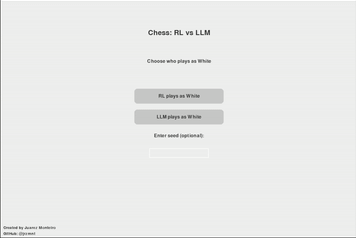

# RL vs LLM model in a game of Chess

In this project, I implemented a chess game where a Reinforcement Learning (RL) agent faces off against a Large Language Model (LLM). The game is displayed through a Pygame-based graphical user interface for visualization.

<p align="center">
  
</p>

## Key Features

- **Reinforcement Learning Agent**: Trained using Proximal Policy Optimization (PPO) from the Stable Baselines3 library for intelligent decision-making.
- **Large Language Model Opponent**: Utilizes a streamlined version of DistilGPT2 to generate competitive chess moves.
- **Interactive Chessboard**: Features move highlighting for enhanced gameplay visualization and user interaction.
- **Real-Time Game Display**: Provides a live view of important game information, including captured pieces and move history, for an improved player experience.
- **Reproducibility**: Customizable random seed ensures consistent and repeatable results across different game sessions.


## Requirements

- **Python 3.7+**: Ensure compatibility with the required libraries.
- **PyTorch**: For training and running the RL and LLM models.
- **Stable Baselines3**: Provides the Proximal Policy Optimization (PPO) algorithm for the RL agent.
- **Pygame**: Powers the graphical user interface for the chessboard and gameplay visualization.
- **python-chess**: A chess library for handling the game's logic and move validation.
- **Transformers (Hugging Face)**: Utilized for loading and running the Large Language Model (DistilGPT2).


## Getting started

   ```
   git clone https://github.com/jrzmnt/chess-rl-vs-llm.git
   cd chess-rl-vs-llm
   pip install -r requirements.txt
   
   ```
Start the game using the main script:
```
python src\main.py
```

## How It Works

1. The **RL agent**, utilizing Proximal Policy Optimization (PPO), is trained within a custom chess environment defined in `chess_environment/chess_env.py`.
2. The **LLM agent**, built with a streamlined version of DistilGPT2, generates moves based on the current board state through the logic in `llm_player/llm_agent.py`.
3. The agents take turns making moves, which are visually represented on the chessboard using the Pygame interface developed in `chess_gui.py`.
4. Game flow, including initialization, turn management, and determining game-ending scenarios, is coordinated by the `main.py` script.
5. The match proceeds until either checkmate, stalemate, or the maximum move count is reached.


## Customization

- Regulation of the RL training parameters can be done in `rl_player/rl_agent.py`
- Modification of the LLM prompt or model can be done in `llm_player/llm_agent.py`
- Customization of the GUI appearance can be done in `chess_gui.py`

## FYI
This is just an environment i built to test various other RL and LLM models over the time. Feel free to contribute by submitting a Pull request.

## Reference

- [Stable Baselines3](https://github.com/DLR-RM/stable-baselines3) : RL
- [Hugging Face Transformers](https://github.com/huggingface/transformers) : LLM 
- [python-chess](https://github.com/niklasf/python-chess) : Chess game logic
- [Pygame](https://www.pygame.org/) : GUI

